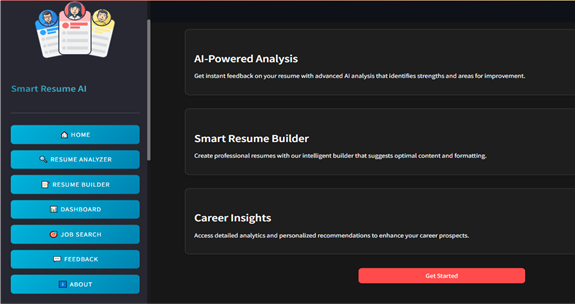

# 🧠 Resume AI – An AI-Powered Resume Analyzer and Builder

Resume AI is an intelligent, web-based application designed to help users **build, optimize, and analyze** resumes using Artificial Intelligence. Built using Python, Streamlit, and advanced NLP techniques, the tool provides ATS compatibility analysis, keyword and skill gap detection, and job-role-specific recommendations to improve the effectiveness of resumes in real-world job markets.

## 🌐 Preview

 <!-- Add your actual image here later -->

---

## 🎯 Objectives

* Create professional and ATS-friendly resumes
* Detect keyword and skill gaps using AI/NLP
* Offer real-time feedback on formatting and structure
* Provide customizable templates for resume building
* Analyze resumes across multiple formats (PDF, DOCX, XLSX)
* Recommend job roles, trending skills, and relevant resources

---

## 🚀 Features

### 🕵️ Deep Resume Analysis:

* 🛡️ ATS Compatibility Score
* 🔑 Keyword Gap Analysis
* 🧩 Role-specific Feedback
* 📊 Skills Gap Breakdown

### 🎨 AI-Powered Resume Builder:

* Modern, Minimal, Professional, Creative Templates
* Smart Content Suggestions
* ATS-Optimized Formatting
* Customizable Sections

### 🤖 AI Optimization Engine:

* 💡 Keyword Highlighting
* ✍️ Content Enhancement Tips
* 🌟 Industry-Specific Insights

---

## 🌟 Why Use Smart Resume AI?

Get real-time feedback, boost your resume's impact, and maximize your chances of getting shortlisted—all with a sleek and intuitive interface.

---

## 👨‍💻 Live Demo

Try it Now: [Open in Streamlit](https://resumeai-project.streamlit.app/)

---

## 🛠 Tech Stack

### 🌐 Frontend

* Streamlit
* HTML/CSS

### ⚙️ Backend

* Python 3.9+
* Selenium + Chrome WebDriver
* Gemini API (Google AI)

### 🗄️ Database

* SQLite3

### 📦 Modules & Libraries

* spaCy, NLTK, PyPDF2, python-docx, openpyxl
* scikit-learn, dotenv, plotly, chromedriver-autoinstaller

---

## 📁 Folder Structure

```
Smart-AI-Resume-Analyzer/
├── assets/
├── modules/
├── templates/
├── utils/
│   └── .env
├── app.py
├── requirements.txt
├── Dockerfile
└── README.md
```

---

## ⚙️ How It Works

### 1. Upload or Start from Scratch

* Import your resume (PDF/Word) or create from scratch using builder

### 2. Analyze Your Resume

* ATS Compatibility: Recruiter-friendly check
* Keyword Gap: Highlight what's missing
* Skills Gap: Discover missing skills

### 3. Build a Stunning Resume

* Choose from 4 elegant templates
* Customize sections (Skills, Hobbies, Achievements, etc.)

### 4. Download & Apply

* Export your resume in PDF format, job-ready

---

## 🧾 Setup Instructions

### 🔹 Step 1: Clone the Repository

```bash
git clone https://github.com/your-username/Smart-AI-Resume-Analyzer.git
cd Smart-AI-Resume-Analyzer
```

### 🔹 Step 2: (Optional) Create a Virtual Environment

```bash
python -m venv venv
# Windows:
venv\Scripts\activate
# macOS/Linux:
source venv/bin/activate
```

### 🔹 Step 3: Install Dependencies

```bash
pip install -r requirements.txt
python -m spacy download en_core_web_sm
```

### 🔹 Step 4: Add Gemini API Key

Create `.env` inside `utils/` directory:

```
GOOGLE_API_KEY=your_google_gemini_api_key
```

> You can get your key from [Google AI Studio](https://makersuite.google.com/app)

### 🔹 Step 5: Run the Application

```bash
streamlit run app.py
```


## ☁️ Streamlit Cloud Deployment

1. Push your code to GitHub
2. Go to [Streamlit Cloud](https://streamlit.io/cloud)
3. Link the repo and set `app.py` as entry point
4. Add a `packages.txt` file with:

```
chromium
chromium-driver
libglib2.0-0
libnss3
libgconf-2-4
libfontconfig1
xvfb
wget
unzip
```

---

## 🔐 Admin Login Credentials

* **Username:** [admin@example.com](mailto:admin@example.com)
* **Password:** admin123

> Admin panel appears post-login


## 🎯 Why Choose Smart Resume AI?

* ✨ Tailored Feedback for Your Dream Job
* 🖼️ Visually Stunning Templates
* ⚡ Build a Resume in Minutes with AI
* 📈 Improve Your Shortlisting Chances

---

## 👨‍💻 Author

**Ravi M Shetty**
📍 SDM Degree College, Honnavar
🔗 [Portfolio](https://ravishetty-portfolio.netlify.app) | [LinkedIn](https://www.linkedin.com/in/ravi-m-shetty) | [GitHub](https://github.com/Ravishetty07)

---

> “Crafting a job-winning resume just got smarter.” 🚀

